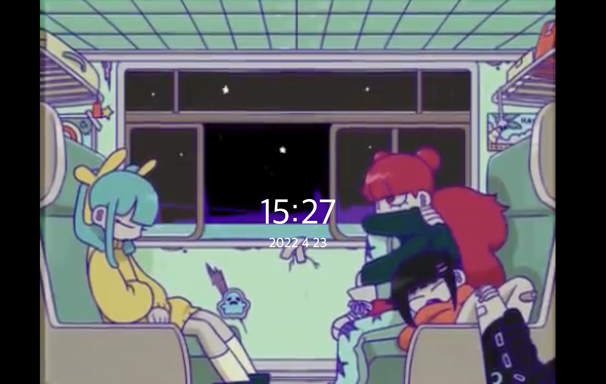

# DashBoard

## 개요

- 좋아하는 유튜브 크리에이터(람다람) 영상으로 대시보드 개발

## 사용기술

- Node.js, Express, Docker

### 이유

- 백엔드 기술은 필요하지 않지만 간단한 서버를 띄우기 위해 node 사용
- 도커 이미지로 관리하여 바로 사용할 수 있도록 도커파일 작성

## 설명

- 유튜브 영상을 배경으로 하여 무한 반복재생
- 시간 / 날짜 표시
- 시간 / 날짜 클릭 시 소리 유/무 변경
- 웹브라우저 정책 상 첫 재생 시 음소거

